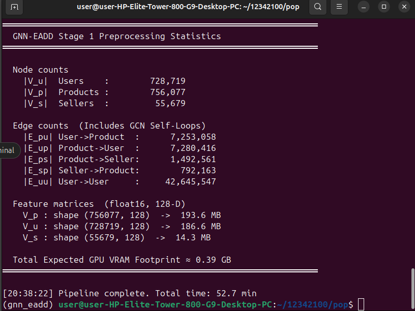

# GNN-EADD: CUDA-Accelerated Fraud Detection on Heterogeneous Graphs

This repository implements a high-performance, GPU-accelerated version of the **GNN-EADD** (Graph Neural Network-based E-commerce Anomaly Detection via Dual-stage Learning) framework. By modeling the Amazon Electronics ecosystem as a heterogeneous graph, this project detects fraudulent products, fake reviews, and compromised accounts using a combination of unsupervised structural learning and semi-supervised fine-tuning.

## 🏗️ Project Architecture

The project is divided into the **Data Pipeline** (Preparation) and the **Model Stages** (Computation):

| Component | Status | Description |
| :--- | :--- | :--- |
| **Data Pipeline** | ✅ Complete | SSD-streaming preprocessing, NLP feature extraction, and CSR generation. |
| **Stage 1 (GAE)** | 🏗️ Next | **Unsupervised Learning**: A Graph Autoencoder learns structural embeddings. |
| **Stage 2 (GAT)** | 🏗️ Next | **Semi-supervised Fine-tuning**: A GAT refines embeddings with labeled anomalies. |

---

## 📊 Data Engineering Pipeline (`data_preprocessing.py`)

The preprocessing pipeline transforms raw Amazon Review and Metadata (JSON.gz) into CUDA-ready binaries. It is designed for **16GB RAM efficiency** using chunked NLP encoding and memory-mapped (memmap) outputs.

### 1. Heterogeneous Graph Schema
We construct a graph with three node types and five directed edge types to capture the complexity of the marketplace:
* **Nodes**: Users ($V_u$), Products ($V_p$), and Sellers ($V_s$, defined by unique brand names).
* **Edges**: Purchase ($E_{pu}$), Selling ($E_{ps}$), and User-User interaction ($E_{uu}$ based on co-purchase proximity).
* **Connectivity**: Includes GCN-standard self-loops ($\tilde{A} = A + I$) to preserve self-features during message passing.

### 2. Implementation Phases
The pipeline executes in four sequential passes:

* **Phase 1: ID Space Construction**: Enumerates ASINs, UserIDs, and Brands to build a unified, non-overlapping global ID namespace.
* **Phase 2: NLP Fraud Signatures**: Streams reviews to compute statistical signals (rating variance, lexical diversity, and sentiment-rating mismatch via VADER) without holding raw text in RAM.
* **Phase 3: Multi-modal Feature Encoding**: 
    * **Text**: Product titles/descriptions are encoded via `all-MiniLM-L6-v2` and compressed to 96-D via Incremental PCA.
    * **Final Vectors**: All nodes are projected into a **128-D float16** space, combining NLP embeddings, category multi-hot encodings, and behavioral statistics.
* **Phase 4: CSR Topology Generation**: Builds Compressed Sparse Row (CSR) binaries for all five edge types. This format reduces memory footprint from $\mathcal{O}(N^2)$ to $\mathcal{O}(|E|)$ and enables efficient sparse traversal on the GPU.

---

## 🚀 Preprocessing Results

The following statistics were generated using the **Amazon Electronics 5-core** dataset:

| Metric | Value |
| :--- | :--- |
| **Total Nodes** | **1,540,475** |
| **Total Edges** | **~59.4 Million** (including self-loops) |
| **Dominant Edge** | $E_{uu}$ (User-User) at **42.6M edges** |
| **GPU VRAM Footprint** | **~0.39 GB** (Features only) |
| **Processing Time** | **52.7 Minutes** |

### Preprocessing Output Logs


---

## 🛠️ Technical Implementation & Optimization

Our implementation optimizes the original GNN-EADD bottlenecks:
* **Memory Efficiency**: Uses `numpy.memmap` for feature matrices, allowing subsequent CUDA kernels to access data without saturating system RAM.
* **Sparsity Awareness**: Topology is stored in `row_ptr.bin` and `col_idx.bin` (int32) for direct loading into CUDA streams.
* **Precision**: All features are stored in `float16` to halve the VRAM footprint while maintaining sufficient range for GCN operations.

## 📦 Dependencies
```bash
pip install numpy scikit-learn sentence-transformers nltk
python -c "import nltk; nltk.download('vader_lexicon')"
```

## ⏭️ Upcoming Model Stages

### Stage 1: Unsupervised Graph Autoencoder (GAE)
We will implement a **Triple-Stream CSR GCN Encoder** that processes heterogeneous edges concurrently via independent CUDA streams. The decoder will utilize a **Tiled Shared-Memory** kernel to compute reconstruction loss without materializing the full $N \times N$ adjacency matrix.

### Stage 2: Semi-supervised Graph Attention (GAT)
A hardware-level GAT kernel will perform all-neighbor reductions using **warp-shuffle primitives** (`__shfl_sync`). This eliminates global synchronization barriers and uses numerically stable softmax to prevent floating-point overflow during attention scoring.
